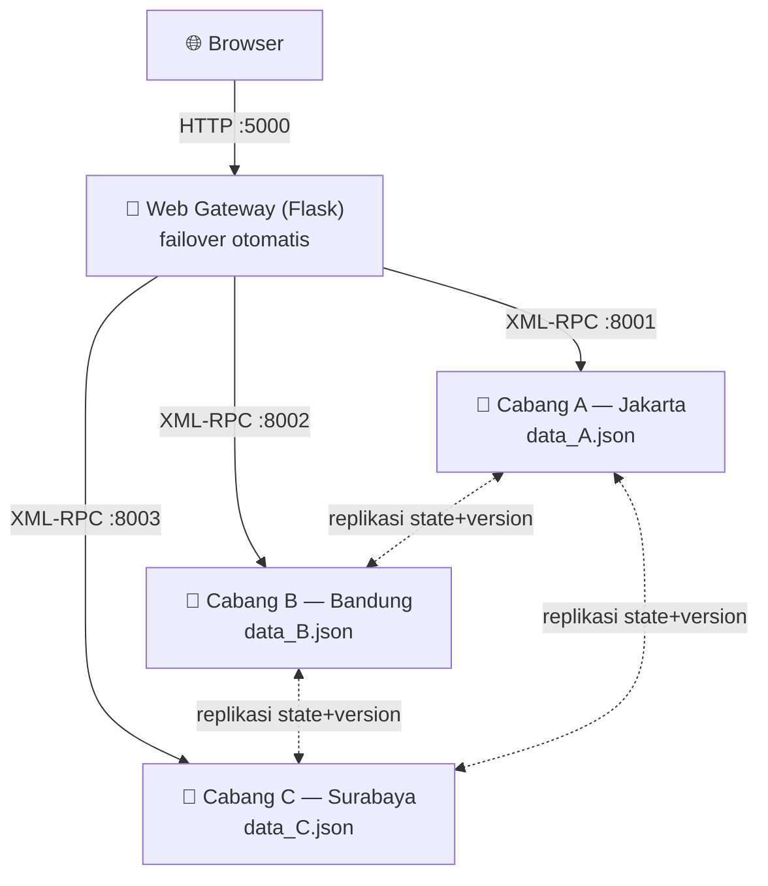
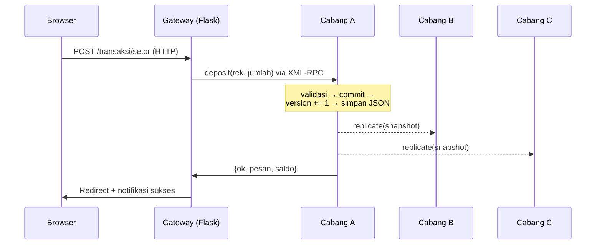

<div align="center">

# 🏦 Sistem Bank Terdistribusi

**Simulasi bank dengan 3 node cabang yang saling tersinkronisasi — Tugas Sistem Terdistribusi**


*RPC · Microservices · Replikasi Data · Fault Tolerance/Failover · Sinkronisasi Ulang*

</div>

---

## 📑 Daftar Isi

- [✨ Konsep yang Didemonstrasikan](#-konsep-yang-didemonstrasikan)
- [🧱 Arsitektur](#-arsitektur)
- [💻 Fitur Dashboard](#-fitur-dashboard)
- [🚀 Cara Menjalankan](#-cara-menjalankan)
  - [Prasyarat](#prasyarat)
  - [1. Install Dependensi](#-install-dependensi-sekali-saja)
  - [2. Jalankan dengan Satu Perintah](#-jalankan-semua-dengan-satu-perintah)
  - [Mode Manual — Demo Failover](#-mode-manual--untuk-demo-failover-4-terminal)
  - [Mode Multi-Laptop (LAN)](#-mode-multi-laptop--tiap-cabang-di-laptop-berbeda)
- [🎬 Skenario Demo](#-skenario-demo)
- [📂 Struktur Kode](#-struktur-kode)
- [🚧 Batasan & Validasi](#-batasan--validasi)
- [🔄 Reset Data](#-reset-data)
- [🧰 Pemecahan Masalah](#-pemecahan-masalah)

---

## ✨ Konsep yang Didemonstrasikan

| # | Konsep Sistem Terdistribusi | Implementasi di Proyek Ini |
|---|------------------------------|-----------------------------|
| 1 | 📡 **RPC** (Remote Procedure Call) | XML-RPC antar node & gateway (modul `xmlrpc` bawaan Python) |
| 2 | 🧩 **Microservices / REST-Web** | Web gateway Flask sebagai pintu masuk pengguna |
| 3 | 🔁 **Replikasi data** | Setiap transaksi disebarkan ke semua cabang (state + version) |
| 4 | 🛡️ **Fault tolerance / failover** | Gateway otomatis mengalihkan request ke cabang lain yang hidup |
| 5 | 🔄 **Sinkronisasi ulang** | Cabang yang baru hidup menarik data terbaru dari peer saat startup |

---

## 🧱 Arsitektur

```
Browser ──HTTP──> Gateway Flask (port 5000)
                     │  XML-RPC (failover otomatis)
        ┌────────────┼────────────┐
        ▼            ▼            ▼
   Cabang A      Cabang B      Cabang C
  (RPC :8001)   (RPC :8002)   (RPC :8003)
  data_A.json   data_B.json   data_C.json
        └──── replikasi RPC antar peer ────┘
```

<details>
<summary>📊 <b>Lihat diagram interaktif (Mermaid — dirender otomatis di GitHub)</b></summary>



**Alur satu transaksi (setor/tarik/transfer):**



</details>

---

## 💻 Fitur Dashboard

Buka `http://localhost:5000` setelah sistem berjalan:

- 📊 **Kartu statistik** — total saldo, jumlah rekening, node aktif, transaksi tercatat.
- 🗺️ **Topologi sistem hidup** — visualisasi Browser → Gateway → 3 node dengan
  animasi paket data RPC; garis putus merah menandakan node mati.
- 🟢 **Status node real-time** — badge **AKTIF/MATI** per cabang beserta
  **versi state** (`v0, v1, v2, …`) dan tag **SINKRON/TERTINGGAL** sebagai
  bukti replikasi konsisten antar node.
- 🧾 **Daftar rekening & riwayat transaksi** yang tereplikasi — identik dilihat
  dari cabang mana pun ("Data dilayani oleh Cabang X").
- 💸 **Form transaksi interaktif** — pilih node pemroses (kartu radio dengan
  status hidup/mati), tombol nominal cepat, dan panel *"Alur di Balik Layar"*
  yang menjelaskan 5 langkah terdistribusi setiap transaksi.

---

## 🚀 Cara Menjalankan

### Prasyarat

| Kebutuhan | Keterangan |
|-----------|------------|
| **Python ≥ 3.8** | Cek dengan `python --version` (Windows) atau `python3 --version` (Linux/macOS) |
| **pip** | Biasanya sudah termasuk dalam instalasi Python |
| **Browser modern** | Chrome / Edge / Firefox / Safari |

> 💡 **Windows:** jika perintah `python` tidak dikenali, coba `py`.
> Unduh Python dari [python.org](https://www.python.org/downloads/) dan centang
> **"Add Python to PATH"** saat instalasi.

### 📦 Install dependensi (sekali saja)

Buka terminal **di folder proyek** (`bank-terdistribusi`), lalu ikuti sesuai OS:

<details open>
<summary>🪟 <b>Windows (PowerShell / CMD)</b></summary>

```powershell
# Langsung install (tanpa virtual environment)
pip install -r requirements.txt
```

Atau dengan virtual environment (disarankan):

```powershell
python -m venv .venv
.venv\Scripts\Activate.ps1      # PowerShell
# .venv\Scripts\activate.bat    # jika memakai CMD
pip install -r requirements.txt
```

> ⚠️ Jika PowerShell menolak menjalankan skrip aktivasi
> (*"running scripts is disabled"*), jalankan sekali:
> `Set-ExecutionPolicy -ExecutionPolicy RemoteSigned -Scope CurrentUser`

</details>

<details>
<summary>🐧 <b>Linux (Ubuntu / Debian / Fedora, dll.)</b></summary>

```bash
python3 -m venv .venv
source .venv/bin/activate
pip install -r requirements.txt
```

> ⚠️ Error *externally-managed-environment* (Ubuntu 23.04+/Debian 12+)?
> Virtual environment seperti di atas adalah solusinya — jangan pakai
> `pip install` global.
> Jika modul `venv` belum ada: `sudo apt install python3-venv`

</details>

<details>
<summary>🍎 <b>macOS</b></summary>

```bash
python3 -m venv .venv
source .venv/bin/activate
pip install -r requirements.txt
```

> 💡 macOS bawaan sudah punya `python3`. Jika belum, install lewat
> [Homebrew](https://brew.sh): `brew install python`

</details>

### ⚡ Jalankan semua dengan SATU perintah

| OS | Perintah |
|----|----------|
| 🪟 Windows | `python run_all.py` |
| 🐧 Linux | `python3 run_all.py` |
| 🍎 macOS | `python3 run_all.py` |

✅ Skrip otomatis menyalakan **3 node cabang + web gateway**, lalu membuka
browser ke `http://localhost:5000`.
⏹️ Tekan **Ctrl+C** di terminal untuk mematikan semua node sekaligus.

### 🔧 Mode manual — untuk demo failover (4 terminal)

Jalankan tiap komponen di terminal terpisah agar bisa mematikan satu node
secara independen (`python3` untuk Linux/macOS):

```bash
# Terminal 1..3 — node cabang
python -m branch.main --name A
python -m branch.main --name B
python -m branch.main --name C

# Terminal 4 — web gateway
python -m gateway.main
```

### 🌐 Mode multi-laptop — tiap cabang di laptop berbeda

<details>
<summary><b>Klik untuk membuka panduan lengkap mode LAN</b></summary>

1. Pastikan semua laptop terhubung ke **jaringan WiFi/LAN yang sama**.
2. Cek IP tiap laptop:

   | OS | Perintah | Yang dilihat |
   |----|----------|--------------|
   | 🪟 Windows | `ipconfig` | baris **IPv4 Address** |
   | 🐧 Linux | `hostname -I` atau `ip addr` | IP `192.168.x.x` |
   | 🍎 macOS | `ipconfig getifaddr en0` | output langsung IP |

3. Salin `network.example.json` menjadi `network.json`, isi IP tiap laptop:

   ```json
   {
     "branches": {
       "A": {"host": "192.168.1.10", "port": 8001},
       "B": {"host": "192.168.1.11", "port": 8002},
       "C": {"host": "192.168.1.12", "port": 8003}
     },
     "gateway": {"host": "192.168.1.10", "port": 5000}
   }
   ```

4. Salin folder proyek ini (termasuk `network.json` **yang sama**) ke semua laptop.
5. Jalankan node sesuai peran tiap laptop:

   ```bash
   # Laptop 1 — Cabang A + gateway (2 terminal)
   python -m branch.main --name A
   python -m gateway.main

   # Laptop 2 — Cabang B
   python -m branch.main --name B

   # Laptop 3 — Cabang C
   python -m branch.main --name C
   ```

6. Semua laptop membuka dashboard di `http://<IP-laptop-gateway>:5000`
   (contoh: `http://192.168.1.10:5000`).

> **Catatan penting:**
>
> - Keberadaan file `network.json` **otomatis mengaktifkan mode jaringan**
>   (server menerima koneksi dari komputer lain). Hapus/rename file itu untuk
>   kembali ke mode lokal.
> - `run_all.py` sengaja **tidak bisa dipakai** di mode ini (hanya untuk mode
>   satu komputer).
> - Gateway boleh diletakkan di laptop mana pun — samakan `gateway.host`
>   di `network.json`.
> - Jika koneksi antar laptop gagal, izinkan port di firewall:
>
>   | OS | Cara |
>   |----|------|
>   | 🪟 Windows | Klik **"Allow access"** saat Windows Defender Firewall bertanya (pilih *Private networks*) |
>   | 🐧 Linux (ufw) | `sudo ufw allow 8001:8003/tcp && sudo ufw allow 5000/tcp` |
>   | 🍎 macOS | System Settings → Network → Firewall → izinkan koneksi masuk untuk Python |

</details>

---

## 🎬 Skenario Demo

### 1️⃣ Replikasi Data

> Setor uang dan pilih **"proses melalui Cabang A"**.

Perhatikan terminal: Cabang A memproses lalu mengirim replikasi ke B dan C —
badge versi state di dashboard naik serentak (mis. `v1 → v2`) dan semua node
bertanda **SINKRON**. Data konsisten dilihat dari cabang mana pun.

### 2️⃣ Fault Tolerance / Failover

> Matikan **Cabang B**, lalu lakukan transaksi *"melalui Cabang B"*.

Cara mematikan Cabang B (port 8002):

| Mode | OS | Cara |
|------|----|------|
| Manual (4 terminal) | Semua | Tekan **Ctrl+C** di terminal Cabang B |
| `run_all.py` | 🪟 Windows (PowerShell) | `netstat -ano \| findstr :8002` → catat PID → `taskkill /F /PID <PID>` |
| `run_all.py` | 🐧 Linux | `fuser -k 8002/tcp` |
| `run_all.py` | 🍎 macOS | `lsof -ti tcp:8002 \| xargs kill -9` |

Dashboard menandai Cabang B **MATI** (garis topologi putus merah). Transaksi
tetap **berhasil** — gateway otomatis mengalihkan ke cabang lain dan muncul
notifikasi *"… otomatis dialihkan ke Cabang X (failover)"*.

### 3️⃣ Sinkronisasi Ulang

> Lakukan beberapa transaksi selagi Cabang B mati, lalu hidupkan kembali.

```bash
python -m branch.main --name B     # python3 di Linux/macOS
```

Saat startup, B menarik snapshot terbaru dari peer (log:
*"Sinkronisasi startup dari peer berhasil"*) — versi state B langsung
menyusul node lain dan kembali **SINKRON** di dashboard.

---

## 📂 Struktur Kode

```
bank-terdistribusi/
├── run_all.py             # 🚀 launcher satu perintah (mode satu komputer)
├── requirements.txt       # 📦 dependensi Python (Flask)
├── network.example.json   # 🌐 contoh konfigurasi mode multi-laptop
├── common/
│   └── config.py          # ⚙️ konfigurasi terpusat (cabang, port, network.json, batas saldo)
├── branch/                # ── 🏦 MODUL NODE CABANG ──
│   ├── main.py            #    entry point (argparse + wiring)
│   ├── storage.py         #    persistensi JSON + seed rekening
│   ├── bank.py            #    logika bisnis: saldo, setor, tarik, transfer, versi state
│   ├── replication.py     #    broadcast ke peer + sinkronisasi startup
│   └── server.py          #    server XML-RPC multi-thread (register fungsi remote)
├── gateway/               # ── 🧩 MODUL WEB GATEWAY ──
│   ├── main.py            #    entry point Flask
│   ├── rpc_client.py      #    klien RPC + failover + cek status/versi node
│   ├── routes.py          #    route web (dashboard & transaksi)
│   ├── templates/         #    halaman HTML (bahasa Indonesia)
│   └── static/            #    style.css (desain dashboard)
└── data/                  # 💾 file JSON per cabang (dibuat otomatis)
```

---

## 🚧 Batasan & Validasi

- ✔️ Jumlah transaksi harus **bilangan bulat positif** (divalidasi di node cabang).
- ✔️ Saldo maksimum per rekening **Rp2.000.000.000** — aman dari batas integer
  XML-RPC (2³¹ − 1).
- ✔️ Riwayat transaksi menyimpan **50 entri terakhir** per cabang.
- ✔️ Transfer ke rekening yang sama ditolak; saldo tidak cukup ditolak.

---

## 🔄 Reset Data

Hapus folder `data/` lalu jalankan ulang — rekening contoh dibuat kembali
otomatis (Andi Akbar Arya Putra, Muh. As'ad Habib, Muhammad Pasyafatir):

| OS | Perintah |
|----|----------|
| 🪟 Windows (PowerShell) | `Remove-Item -Recurse -Force data` |
| 🪟 Windows (CMD) | `rmdir /s /q data` |
| 🐧 Linux / 🍎 macOS | `rm -rf data` |

---

## 🧰 Pemecahan Masalah

<details>
<summary><b>❌ <code>python</code> tidak dikenali (Windows)</b></summary>

Gunakan `py` sebagai pengganti (`py run_all.py`), atau install ulang Python
dari [python.org](https://www.python.org/downloads/) dengan mencentang
**"Add Python to PATH"**.

</details>

<details>
<summary><b>❌ Port 5000/8001–8003 sudah terpakai</b></summary>

Ada proses lama yang masih berjalan. Matikan proses pada port tersebut:

| OS | Perintah |
|----|----------|
| 🪟 Windows | `netstat -ano \| findstr :5000` → `taskkill /F /PID <PID>` |
| 🐧 Linux | `fuser -k 5000/tcp` |
| 🍎 macOS | `lsof -ti tcp:5000 \| xargs kill -9` |

> 💡 macOS Monterey+ memakai port 5000 untuk **AirPlay Receiver** —
> nonaktifkan di System Settings → General → AirDrop & Handoff, atau matikan
> fiturnya sementara.

</details>

<details>
<summary><b>❌ <i>externally-managed-environment</i> saat pip install (Linux)</b></summary>

Gunakan virtual environment:

```bash
sudo apt install python3-venv        # sekali saja, jika perlu
python3 -m venv .venv
source .venv/bin/activate
pip install -r requirements.txt
```

</details>

<details>
<summary><b>❌ Laptop lain tidak bisa membuka dashboard (mode LAN)</b></summary>

1. Pastikan `network.json` **identik** di semua laptop dan IP-nya benar.
2. Pastikan semua laptop berada di jaringan WiFi/LAN yang sama
   (beberapa WiFi kampus memblokir koneksi antar perangkat / *AP isolation*).
3. Izinkan port di firewall (lihat tabel firewall pada bagian
   [Mode Multi-Laptop](#-mode-multi-laptop--tiap-cabang-di-laptop-berbeda)).
4. Tes koneksi dari laptop lain: `ping <IP-laptop-gateway>`.

</details>

<details>
<summary><b>⚠️ Dashboard menampilkan semua node MATI padahal baru dijalankan</b></summary>

Node butuh ±1–2 detik untuk siap. Klik tombol **"Muat Ulang"** di dashboard.
Jika masih mati, periksa terminal node — kemungkinan port bentrok (lihat atas).

</details>

---

<div align="center">

**Tugas Sistem Terdistribusi** · RPC (XML-RPC) · REST/Web (Flask) · Replikasi · Failover · Sinkronisasi

</div>
